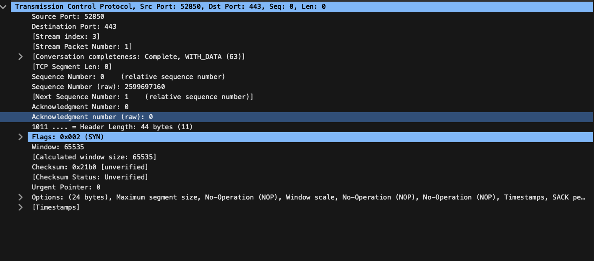
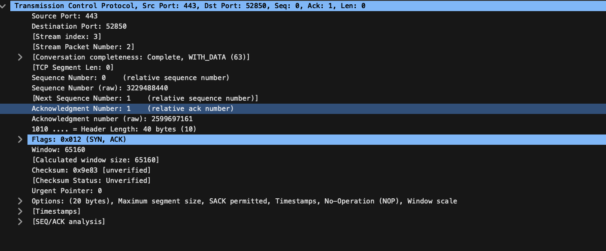
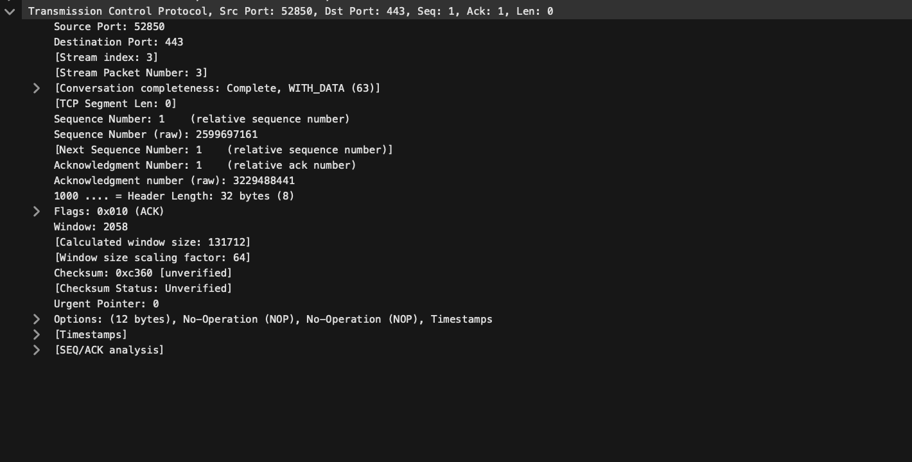
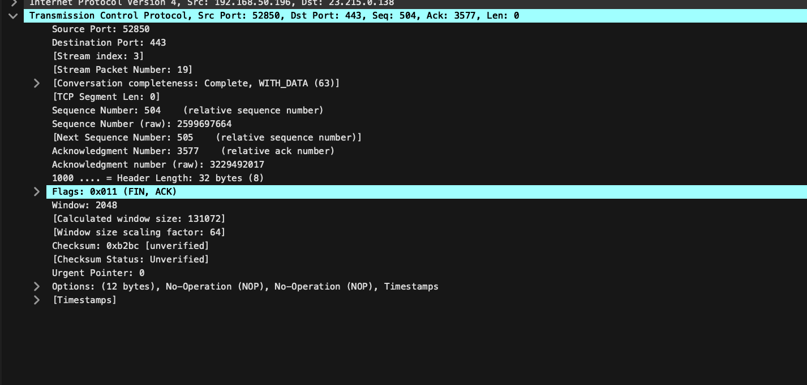

# Analyzing a TCP (Transmission Control Protocol) 3‑Way Handshake & Connection Teardown with Wireshark
Author: Zachary Crowe
Date: June 19, 2025

# Table of Contents

1. Introduction
2. Installing Wireshark
3. Capturing a TCP Session
4. Filtering Your Capture
5. Refresher: TCP/IP & OSI Models
6. The TCP 3‑Way Handshake
7. Connection Teardown
8. Annotated Packet Analysis

## Introduction

This guide walks through capturing and explaining a full TCP (Transmission Control Protocol) 3‑way handshake and graceful teardown using Wireshark. Whether you are refreshing your knowledge of the OSI (Open Systems Interconnection) layers or just learning how to read packet captures, the step‑by‑step instructions and annotated screenshots will help you master the fundamentals.

## Installing Wireshark

### 1. Download

| Operating System                   | Command / Action                                                                                                                                                                                                                                                                                  |
| ---------------------------------- | ------------------------------------------------------------------------------------------------------------------------------------------------------------------------------------------------------------------------------------------------------------------------------------------------- |
| **Windows**                        | Download the latest stable installer from [https://www.wireshark.org/download.html](https://www.wireshark.org/download.html). When prompted, install **Npcap** (Network Packet Capture) driver—Wireshark needs it for packet sniffing.                                                            |
| **macOS**                          | With Homebrew (package manager) installed, run: `brew install --cask wireshark` Grant packet-capture permissions when macOS prompts for them.                                                                                                                                               |
| **Linux (Debian / Ubuntu)**        | `bash sudo apt update && sudo apt install wireshark ` During installation choose **“Yes”** to allow non-root packet capturing, then add yourself to the *wireshark* group: `bash sudo usermod -aG wireshark $USER ` Log out and back in for the group change to take effect. |
| **Linux (Fedora / RHEL / CentOS)** | `bash sudo dnf install wireshark wireshark-qt `                                                                                                                                                                                                                                             |
### Set Up

1. Launch Wireshark.

2. Verify that your primary network interface (e.g., en0, eth0, Wi‑Fi) appears in the capture list.

3. If no interfaces are listed, confirm Npcap or dumpcap permissions (Linux) are configured.

## Capturing a TCP Session

1. Select the correct interface (usually the one with the highest packets/s count) and click the blue shark‑fin icon to start capture.

2. Generate a quick TCP exchange in another window (pick one):

    * Terminal: curl -I https://example.com (fetches headers only)

    * Browser: Load any HTTPS site.

    * Command‑line: telnet example.com 80 then CTRL+] & quit.

3. Stop the capture after a few seconds (red square button) to keep the file small.

4. Save the capture as tcp_handshake.pcapng.

## Filtering your Capture

1. In the Display Filter bar enter:

    * tcp.stream eq 0

    * This isolates the first TCP conversation Wireshark observed.

3. Alternatively, filter by SYN packets:

    * tcp.flags.syn == 1 && tcp.flags.ack == 0

4. Right‑click any packet in your stream → Follow ▸ TCP Stream to view only that conversation and its teardown.

## Refresher: TCP/IP & OSI Models 

| # | Layer        | Common Protocols                                                                                   |
| - | ------------ | -------------------------------------------------------------------------------------------------- |
| 7 | Application  | HTTP (Hypertext Transfer Protocol), DNS (Domain Name System), SMTP (Simple Mail Transfer Protocol) |
| 6 | Presentation | TLS (Transport Layer Security), SSL (Secure Sockets Layer)                                         |
| 5 | Session      | NetBIOS (Network Basic Input/Output System), RPC (Remote Procedure Call)                           |
| 4 | Transport    | TCP (Transmission Control Protocol), UDP (User Datagram Protocol)                                  |
| 3 | Network      | IP (Internet Protocol), ICMP (Internet Control Message Protocol)                                   |
| 2 | Data Link    | Ethernet, 802.11 Wi-Fi                                                                             |
| 1 | Physical     | Cables, radio waves, fiber                                                                         |

## The TCP 3‑Way Handshake

Client                         Server
   | --- SYN (Synchronize) ---> |
   | <-- SYN-ACK (Synchronize-Acknowledge) -- |
   | --- ACK (Acknowledge) ---> |

1. SYN: Client sends a synchronization request, proposing an initial sequence number (ISN).

2. SYN‑ACK: Server acknowledges the SYN and proposes its own ISN.

3. ACK: Client acknowledges server’s ISN, establishing the connection (ESTABLISHED state).

After this handshake, data transfer can begin via PSH (Push) and ACK packets.

## Connection Teardown

A graceful close typically performs a 4‑way FIN (Finish) handshake:

1. FIN from the sender.

2. ACK by the receiver.

3. FIN from the receiver.

4. ACK by the original sender.

RST (Reset) can appear when a party aborts the connection abruptly.

## Annotated Packet Analysis

> **Context:** 192.168.50.196 (= client) initiates an HTTPS session to 23.215.0.138:443.  
> Capture shows the classic three-way handshake, followed by a graceful FIN/ACK teardown.

---

### 1  Packet #1 – Client → Server `[SYN]`

| Field | Value | Why it matters |
|-------|-------|----------------|
| **Src Port** | **52850** | Ephemeral port chosen by the client for this connection. |
| **Dst Port** | **443** | Standard HTTPS. |
| **Flags** | **SYN=1, ACK=0** | Start of a new TCP connection. |
| **Seq Num** | **0** (relative) | ISN = Initial Sequence Number establishes byte-numbering. |
| **MSS option** | **1460 bytes** | Client can accept 1460-byte data segments (MTU 1500 – 40 bytes IP+TCP). |
| **Window Size** | **65 535** | How many bytes the client is ready to receive before ACKing. |

---

### 2  Packet #2 – Server → Client `[SYN, ACK]`

| Field | Value | Why it matters |
|-------|-------|----------------|
| **Flags** | **SYN=1, ACK=1** | Server agrees to the connection and acknowledges client’s ISN. |
| **Ack Num** | **1** (client ISN + 1) | Confirms receipt of the client’s SYN. |
| **Seq Num** | **0** (relative) | Server’s own ISN. |
| **Window Size** | **131 712** | Server’s receive buffer advertisement. |

---

### 3  Packet #3 – Client → Server `[ACK]`

| Field | Value |
|-------|-------|
| **Flags** | **ACK=1** (no SYN) |
| **Ack Num** | **1** (server ISN + 1) |

*After this ACK, both sides have exchanged ISNs and acknowledgments – the socket state changes to **ESTABLISHED**. TLS handshake begins in the very next packet.*

---

### 4  Orderly Teardown – `FIN → FIN/ACK → ACK`

1. **Client → Server FIN** – client says *“I’ve finished sending data.”*  
2. **Server → Client ACK** – acknowledges the FIN.  
3. **Server → Client FIN** – server is done too.  
4. **Client → Server ACK** – final confirmation; connection enters **TIME_WAIT** on the client side.

| State Transition | RFC 793 Definition |
|------------------|--------------------|
| ESTABLISHED → FIN-WAIT-1 | Client sends its FIN. |
| FIN-WAIT-1 → FIN-WAIT-2 | Receives ACK of its FIN. |
| FIN-WAIT-2 → TIME-WAIT  | Receives peer’s FIN, sends ACK, waits 2 × MSL. |

---

### Key Takeaways

* **Three packets** build a reliable byte-stream: SYN → SYN/ACK → ACK.  
* MSS & Window Size options tune performance from the very first segment.  
* Orderly FIN/ACK teardown prevents data loss; **TIME_WAIT** protects late segments from prior connections.

# Notes and Sources

RFC 793 – TCP Specification - [TCP Specifications](https://www.rfc-editor.org/rfc/rfc793.html)

Wireshark User Guide – https://www.wireshark.org/docs/

Stevens, W. R. – TCP/IP Illustrated, Vol 1 - [TCP/IP Illustrated PDF](https://www.r-5.org/files/books/computers/internals/net/Richard_Stevens-TCP-IP_Illustrated-EN.pdf)

